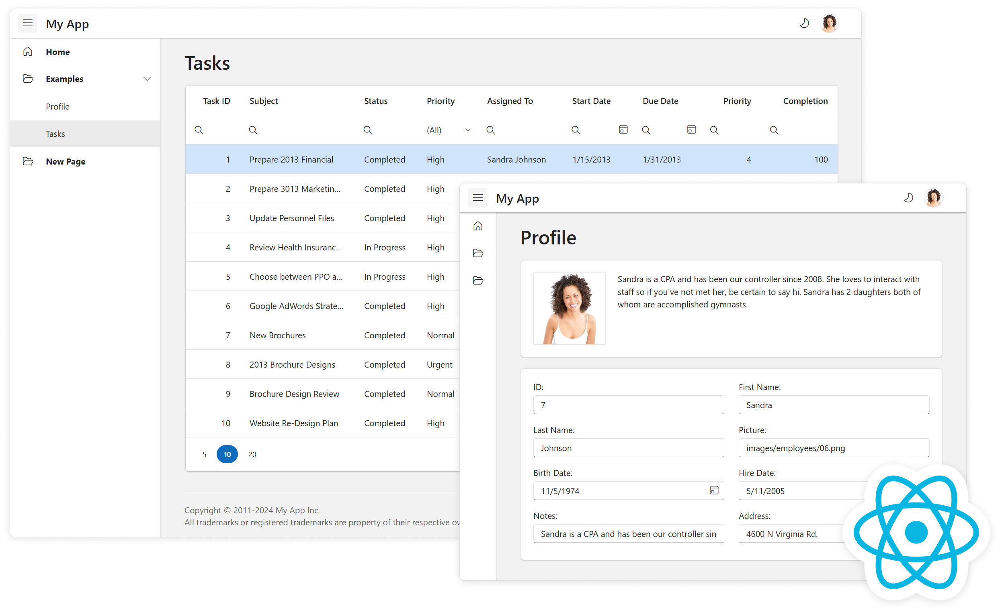

# DevExtreme React Template

The DevExtreme React Template is a React application with a navigation menu and sample views in a responsive layout (see a [live preview](https://devexpress.github.io/devextreme-react-template)). This application is created with [Vite](https://vite.dev/guide/) and uses [DevExtreme React components](https://js.devexpress.com/Documentation/Guide/React_Components/DevExtreme_React_Components/).

## Getting Started

For more information about the DevExtreme React Template and how to customize it, refer to the following help topic: [Application Template](https://js.devexpress.com/Documentation/Guide/React_Components/Application_Template/).

## License

**DevExtreme React Template is released as a MIT-licensed (free and open-source) add-on to DevExtreme.**

- [DevExtreme License](https://js.devexpress.com/Licensing/)
- [Free trial](http://js.devexpress.com/Buy/)